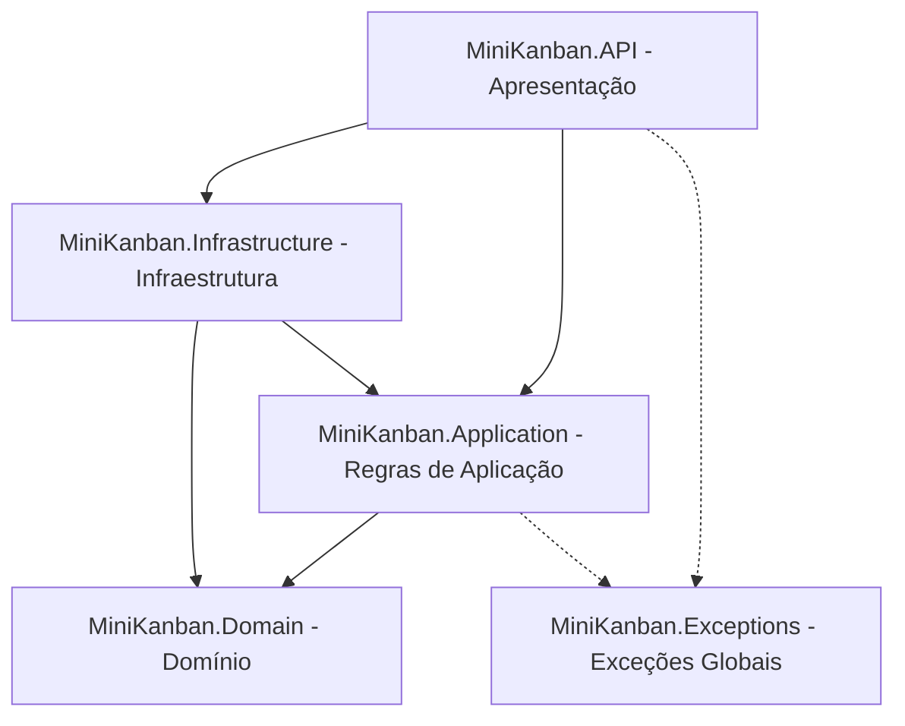

# MiniKanban API 🚀

API robusta para gerenciamento de quadros Kanban, desenvolvida em C# com .NET 8, utilizando os princípios da Clean Architecture (Arquitetura Limpa), persistência de dados em PostgreSQL e autenticação baseada em JWT.

---

## 📌 Arquitetura do Projeto

A solução está estruturada de acordo com os conceitos da Clean Architecture, garantindo separação de responsabilidades, testabilidade e independência de frameworks externos.



### Explicação das Camadas

*   **`MiniKanban.Domain`**: O núcleo do sistema. Contém as entidades de negócio (ex: `User`), regras essenciais do domínio, interfaces base e abstrações. É totalmente independente de frameworks e tecnologias externas.
*   **`MiniKanban.Application`**: Responsável por orquestrar o fluxo de dados da aplicação. Contém os casos de uso, interfaces de serviços, DTOs (Data Transfer Objects), validações e helpers (como criptografia de senha). Depende apenas da camada de Domínio.
*   **`MiniKanban.Infrastructure`**: Implementa as tecnologias e integrações externas necessárias para a aplicação rodar. Contém o DbContext do Entity Framework Core, as migrações de banco, os repositórios concretos e o controle de Unit of Work.
*   **`MiniKanban.API`**: A porta de entrada da aplicação. Implementa as rotas REST usando Minimal APIs, tratamento global de exceções, filtros customizados do Swagger e configurações de autenticação JWT/Autorização.
*   **`MiniKanban.Exceptions`**: Uma camada de suporte contendo as definições de exceções customizadas da aplicação (como `BusinessException` e `ValidationError`), permitindo um tratamento de erro consistente e padronizado em todas as camadas.

---

## 🛠️ Tecnologias Utilizadas

*   **.NET 8** (C#)
*   **Entity Framework Core 8** (PostgreSQL Provider)
*   **PostgreSQL 16** (Banco de dados relacional rodando via Docker)
*   **Scalar** e **Swagger** (OpenAPI) para documentação de API interativa
*   **JWT Bearer Authentication** para segurança e autorização de endpoints

---

## ⚙️ Instruções de Inicialização

### Passo 1: Subir o Banco de Dados (PostgreSQL)

O banco de dados PostgreSQL roda dentro de um container Docker. Certifique-se de que o Docker Engine esteja ativo em sua máquina e execute:

1. Abra um terminal e navegue até a pasta `db/` no projeto:
   ```bash
   cd db
   ```
2. Execute o comando para iniciar o container em segundo plano:
   ```bash
   docker compose up -d
   ```
   *(Nota: O banco subirá mapeado para a porta local `5433`, conforme configurado no `docker-compose.yml` e na connection string da aplicação).*

---

### Passo 2: Executar a Aplicação (API)

Com o banco de dados ativo, a API se encarregará de criar a estrutura de tabelas e inserir o usuário administrador inicial (`admin`) na primeira execução.

1. Navegue até a raiz do projeto.
2. Execute o seguinte comando do .NET CLI:
   ```bash
   dotnet run --project src/MiniKanban.API/MiniKanban.API.csproj --launch-profile http
   ```
3. A aplicação estará ativa em:
   *   `http://localhost:5093`

---

## 📖 Documentação Interativa com Scalar

Esta API adota o **Scalar** como a ferramenta principal de visualização da documentação de endpoints, proporcionando uma experiência de teste moderna, bonita e interativa.

*   **URL da Documentação:** [http://localhost:5093/api-docs](http://localhost:5093/api-docs)
*   **JSON da Especificação OpenAPI:** [http://localhost:5093/swagger/v1/swagger.json](http://localhost:5093/swagger/v1/swagger.json)

### 💡 Destaque: Filtro de Exceções Customizado

A documentação integra perfeitamente as respostas de erro HTTP devido ao `ExceptionResponseOperationFilter`. 

Esse filtro OpenAPI intercepta cada endpoint dinamicamente na inicialização do Swagger e adiciona as respostas padrões de erro:
*   **`400 Bad Request`**: Erros de validação ou de negócios capturados e tratados.
*   **`500 Internal Server Error`**: Erros inesperados no servidor.

Isso garante que todos os retornos do [GlobalExceptionHandler](src/MiniKanban.API/Handlers/GlobalExceptionHandler.cs) estejam devidamente tipados como objetos `ProblemDetails` (RFC 7807) e visíveis na UI do Scalar sem a necessidade de poluir os métodos de mapeamento de endpoints com atributos repetitivos.

---

## 🔑 Acesso Rápido para Testes

Para testar os endpoints protegidos, você pode obter um token JWT efetuando o login.

**Endpoint:** `POST /api/auth/login`

**Corpo da Requisição (JSON):**
```json
{
  "Username": "admin",
  "Password": "Password123"
}
```

**Resposta esperada (JSON):**
```json
{
  "username": "admin",
  "token": "eyJhbGciOiJIUzI1NiIsInR5c..."
}
```
Use o token retornado como cabeçalho de autenticação `Authorization: Bearer <TOKEN>` para acessar o endpoint de teste:
*   `GET /api/protected`
