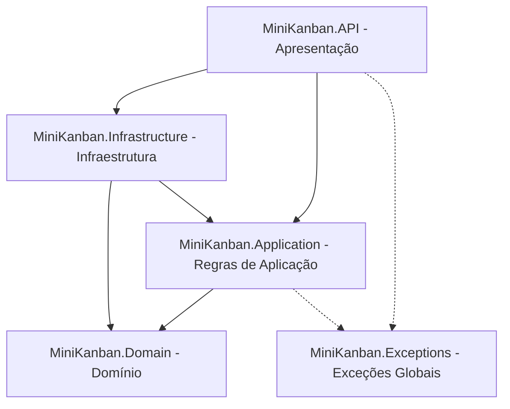

# MiniKanban API 🚀

API robusta para gerenciamento de quadros Kanban, desenvolvida em C# com .NET 8, utilizando os princípios da Clean Architecture (Arquitetura Limpa), persistência de dados em PostgreSQL e autenticação baseada em JWT.

---

## 📌 Arquitetura do Projeto

A solução está estruturada de acordo com os conceitos da Clean Architecture, garantindo separação de responsabilidades, testabilidade e independência de frameworks externos.



### Explicação das Camadas

*   **`MiniKanban.Domain`**: O núcleo do sistema. Contém as entidades de negócio (ex: `User`), regras essenciais do domínio, interfaces base e abstrações. É totalmente independente de frameworks e tecnologias externas.
*   **`MiniKanban.Application`**: Responsável por orquestrar o fluxo de dados da aplicação. Contém os casos de uso, interfaces de serviços, DTOs (Data Transfer Objects), validações e helpers (como criptografia de senha). Depende apenas da camada de Domínio.
*   **`MiniKanban.Infrastructure`**: Implementa as tecnologias e integrações externas necessárias para a aplicação rodar. Contém o DbContext do Entity Framework Core, as configurações de mapeamento, os repositórios concretos e o controle de Unit of Work.
*   **`MiniKanban.API`**: A porta de entrada da aplicação. Implementa as rotas REST usando Minimal APIs, tratamento global de exceções, filtros customizados do Swagger e configurações de autenticação JWT/Autorização.
*   **`MiniKanban.Exceptions`**: Uma camada de suporte contendo as definições de exceções customizadas da aplicação (como `BusinessException` e `ValidationError`), permitindo um tratamento de erro consistente e padronizado em todas as camadas.

---

## 🛠️ Tecnologias Utilizadas

*   **.NET 8** (C#)
*   **Entity Framework Core 8** (PostgreSQL Provider)
*   **PostgreSQL 16** (Banco de dados relacional rodando via Docker)
*   **Scalar** e **Swagger** (OpenAPI) para documentação de API interativa
*   **JWT Bearer Authentication** para segurança e autorização de endpoints

---

## ⚙️ Instruções de Inicialização

### Opção 1: Subir todo o ambiente com Docker Compose

Na raiz do repositório:

```bash
docker compose up --build
```

Serviços disponíveis:

*   Frontend React/Nginx: `http://localhost:3000`
*   API ASP.NET Core: `http://localhost:5093`
*   Scalar/OpenAPI: `http://localhost:5093/api-docs`
*   PostgreSQL: `localhost:5433`

O Compose sobe PostgreSQL, API e frontend. O banco é inicializado com o script [`db/create-tables.sql`](db/create-tables.sql), e a API também possui rotina de inicialização via EF Core para criar tabelas quando não houver migrations aplicadas.

### Opção 2: Subir apenas o banco e rodar a API localmente

```bash
cd db
docker compose up -d
```

Depois, na raiz do repositório:

```bash
dotnet run --project src/MiniKanban.API/MiniKanban.API.csproj --launch-profile http
```

A API local ficará em `http://localhost:5093`.

### Banco de dados e criação de tabelas

O projeto usa PostgreSQL com Entity Framework Core e provider Npgsql. Não há migrations versionadas no repositório; o método documentado de criação do banco é:

*   Docker: script [`db/create-tables.sql`](db/create-tables.sql), montado em `/docker-entrypoint-initdb.d/`.
*   Execução da API: rotina em [`Program.cs`](src/MiniKanban.API/Program.cs) que usa EF Core para criar o banco/tabelas quando necessário.

Usuário administrador inicial:

```json
{
  "username": "admin",
  "password": "Password123"
}
```

---

## 📖 Documentação Interativa com Scalar

Esta API adota o **Scalar** como a ferramenta principal de visualização da documentação de endpoints, proporcionando uma experiência de teste moderna, bonita e interativa.

*   **URL da Documentação:** [http://localhost:5093/api-docs](http://localhost:5093/api-docs)
*   **JSON da Especificação OpenAPI:** [http://localhost:5093/swagger/v1/swagger.json](http://localhost:5093/swagger/v1/swagger.json)

### Como autenticar no Scalar

1. Execute a API e acesse [http://localhost:5093/api-docs](http://localhost:5093/api-docs).
2. Use o endpoint público `POST /api/auth/login`.
3. Copie o valor do campo `token` retornado.
4. No Scalar, abra a opção de autenticação/autorização da documentação.
5. Selecione o esquema **Bearer** e cole apenas o token JWT, sem escrever `Bearer` antes.

A documentação OpenAPI está configurada com o esquema `HTTP Bearer`, então a UI envia automaticamente o cabeçalho:

```http
Authorization: Bearer <TOKEN>
```

### 💡 Destaque: Filtro de Exceções Customizado

A documentação integra perfeitamente as respostas de erro HTTP devido ao `ExceptionResponseOperationFilter`. 

Esse filtro OpenAPI intercepta cada endpoint dinamicamente na inicialização do Swagger e adiciona as respostas padrões de erro:
*   **`400 Bad Request`**: Erros de validação ou de negócios capturados e tratados.
*   **`500 Internal Server Error`**: Erros inesperados no servidor.

Isso garante que todos os retornos do [GlobalExceptionHandler](src/MiniKanban.API/Handlers/GlobalExceptionHandler.cs) estejam devidamente tipados como objetos `ProblemDetails` (RFC 7807) e visíveis na UI do Scalar sem a necessidade de poluir os métodos de mapeamento de endpoints com atributos repetitivos.

---

## 🔑 Acesso Rápido para Testes Manuais

Para testar os endpoints protegidos, você pode obter um token JWT efetuando o login.

**Endpoint:** `POST /api/auth/login`

**Corpo da Requisição (JSON):**
```json
{
  "Username": "admin",
  "Password": "Password123"
}
```

**Resposta esperada (JSON):**
```json
{
  "username": "admin",
  "token": "eyJhbGciOiJIUzI1NiIsInR5c..."
}
```
Use o token retornado como cabeçalho de autenticação `Authorization: Bearer <TOKEN>` para acessar o endpoint de teste:
*   `GET /api/me`

Também é possível criar uma nova conta pelo endpoint público:

**Endpoint:** `POST /api/auth/register`

```json
{
  "name": "Maria Silva",
  "username": "maria",
  "email": "maria@kanban.com",
  "password": "Password123",
  "role": "User"
}
```

---

## 🔓 Endpoints Públicos e Protegidos

### Públicos

| Método | Rota | Descrição |
| --- | --- | --- |
| `POST` | `/api/auth/register` | Cria um novo usuário com senha armazenada em hash. |
| `POST` | `/api/auth/login` | Autentica usuário e retorna token JWT. |
| `GET` | `/health` | Healthcheck da API. |

### Protegidos por JWT

Todos os endpoints abaixo exigem o cabeçalho `Authorization: Bearer <TOKEN>`.

| Método | Rota | Descrição |
| --- | --- | --- |
| `GET` | `/api/me` | Retorna os dados do usuário autenticado. |
| `GET` | `/api/users` | Lista usuários cadastrados sem expor hash de senha. |
| `GET` | `/api/users/{id}` | Busca usuário por ID. |
| `POST` | `/api/boards` | Cria board para o usuário autenticado. O `OwnerId` vem do token. |
| `GET` | `/api/boards` | Lista boards em que o usuário autenticado participa. |
| `GET` | `/api/boards/{id}` | Busca board por ID. |
| `GET` | `/api/users/{ownerId}/boards/owned` | Lista boards criados por um usuário. |
| `PUT` | `/api/boards/{id}` | Atualiza nome e descrição de um board. |
| `DELETE` | `/api/boards/{id}` | Remove board. |
| `POST` | `/api/board-members` | Adiciona usuário como membro de um board. |
| `GET` | `/api/boards/{boardId}/members` | Lista membros de um board. |
| `PUT` | `/api/board-members/{id}` | Atualiza o papel de um membro. |
| `DELETE` | `/api/board-members/{id}` | Remove membro de um board. |
| `POST` | `/api/kanban-columns` | Cria coluna em um board. |
| `GET` | `/api/boards/{boardId}/kanban-columns` | Lista colunas de um board. |
| `PUT` | `/api/kanban-columns/{id}` | Atualiza nome, ordem e WIP limit de uma coluna. |
| `DELETE` | `/api/kanban-columns/{id}` | Remove coluna Kanban. |
| `POST` | `/api/cards` | Cria card em uma coluna. O criador vem do token. |
| `GET` | `/api/columns/{columnId}/cards` | Lista cards de uma coluna. |
| `PUT` | `/api/cards/{id}` | Atualiza card. |
| `DELETE` | `/api/cards/{id}` | Remove card. |
| `POST` | `/api/tags` | Cria tag em um board. |
| `GET` | `/api/boards/{boardId}/tags` | Lista tags de um board. |
| `PUT` | `/api/tags/{id}` | Atualiza tag. |
| `DELETE` | `/api/tags/{id}` | Remove tag. |
| `POST` | `/api/card-tags` | Associa tag a um card. |
| `GET` | `/api/cards/{cardId}/tags` | Lista tags de um card. |
| `DELETE` | `/api/cards/{cardId}/tags/{tagId}` | Remove associação entre card e tag. |
| `POST` | `/api/comments` | Cria comentário em um card. O autor vem do token. |
| `GET` | `/api/cards/{cardId}/comments` | Lista comentários de um card. |
| `PUT` | `/api/comments/{id}` | Atualiza comentário. |
| `DELETE` | `/api/comments/{id}` | Remove comentário. |

---

## 📌 Regras Implementadas Até Agora

*   Ao criar um board, o usuário autenticado vira automaticamente membro com role `Owner`.
*   Não é permitido adicionar o mesmo usuário duas vezes ao mesmo board.
*   Não é permitido adicionar `Owner` manualmente por `/api/board-members`.
*   Não é permitido remover o membro `Owner` do board.
*   Não é permitido alterar a role `Owner` pelo endpoint de membros.
*   Ao criar coluna, a API valida se o board existe.
*   A ordem da coluna não pode ser negativa.
*   O WIP limit não pode ser negativo.
*   A ordem da coluna deve ser única dentro do board no momento da criação.
*   Cards são criados em colunas existentes e registram o usuário autenticado como criador.
*   Tags pertencem a um board e podem ser associadas a cards.
*   Comentários pertencem a um card e registram o usuário autenticado como autor.

---

## 🧪 Roteiro de Testes Manuais

O arquivo [`src/MiniKanban.API/MiniKanban.API.http`](src/MiniKanban.API/MiniKanban.API.http) contém uma coleção de requisições para testar:

*   healthcheck;
*   registro e login;
*   endpoint protegido `/api/me`;
*   CRUD de boards;
*   membros do board;
*   colunas Kanban;
*   cards;
*   tags;
*   associação card/tag;
*   comentários.

Fluxo recomendado para demonstração:

1. Execute `docker compose up --build`.
2. Acesse `http://localhost:5093/api-docs`.
3. Faça login com `admin` / `Password123`.
4. Copie o token JWT no botão de autenticação Bearer.
5. Crie board, coluna, card, tag, associação card/tag e comentário.

---

## ✅ Testes Unitários

O projeto possui testes unitários para os services já implementados em `MiniKanban.Tests`.

Para executar:

```bash
dotnet test tests/MiniKanban.Tests/MiniKanban.Tests.csproj --no-restore -p:UseSharedCompilation=false -m:1
```

Cobertura atual:

*   Registro de usuário.
*   Validação de username/email duplicado.
*   Criação, atualização, busca e remoção de board.
*   Adição, atualização e remoção de membros.
*   Criação e atualização de colunas Kanban.

Última validação local: `17` testes passaram.
